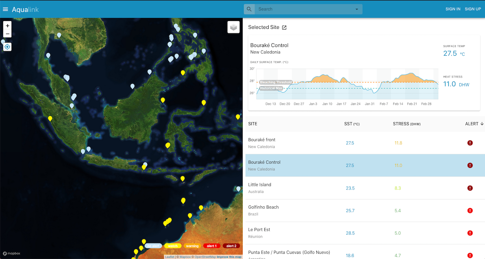

# Aqualink App

This is the main repository for the Aqualink Coral Monitoring Application.

## Description

[Aqualink](https://aqualink.org) is a philanthropically funded system to help people manage their local marine ecosystems in the face of increasing Ocean temperatures. The system consists of satellite-connected underwater temperature sensors and photographic surveys to allow for remote collaboration with scientists across the world. If you are concerned about the effect of climate change on your local reef and want to do something about it then please apply to get a smart buoy for free.



## Development
The app is a monorepo managed by [Lerna](https://github.com/lerna/lerna) using 
[Yarn Workspaces](https://classic.yarnpkg.com/en/docs/workspaces/). Individual packages are found in the `./packages
` directory. The app has two primary components:

- [Nest.js API](./packages/api)
- [React Webapp](./packages/website)

Commands can either be run for a specific package by changing to the package subdirectory and running them directly
, or for the entire project by running them here in this directory.

### Getting Started

To get started, run `yarn install` from this directory. This will install all dependencies for all the packages. You
will also need to do some package-specific configuration such as setting up a `.env` file for environment variables
- see the individual package READMEs for details on this process.

### Running Commands

```bash
# Build all of the packages
yarn build

# Run tests for all of the packages
yarn test

# Start up all of the packages locally
yarn start

# Lint a specific file
yarn lint ./packages/api/src/path/to/file.ts

# Lint all the files in the app
yarn lint:all
```

### Deploying
We are using Google App Engine to deploy applications. The default project we are using is `ocean-systems`.

- Install the Gloud CLI using the instructions available [here](https://cloud.google.com/sdk/docs/quickstart-macos)
- Make sure you are logged in by running `gcloud auth login`
- The run the following commands:

```bash
# Set the project to ocean-systems
gcloud config set project ocean-systems

# Deploy to Google Cloud
yarn deploy

# Wait and verify that the app is running
gcloud app browse
```

## Contributing

Aqualink is an MIT-licensed open source project. Contributions from developers and scientists are welcome!

## License

  Aqualink is [MIT licensed](LICENSE).